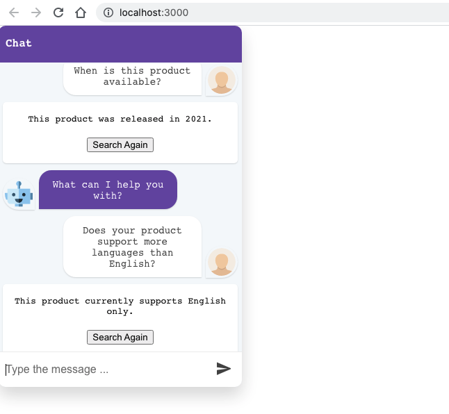
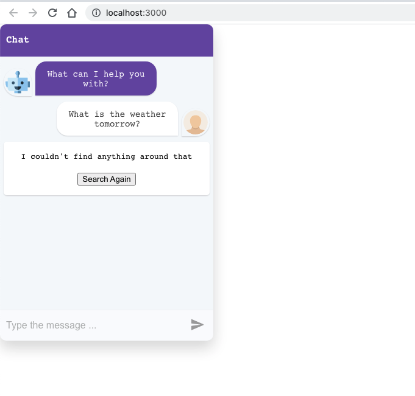
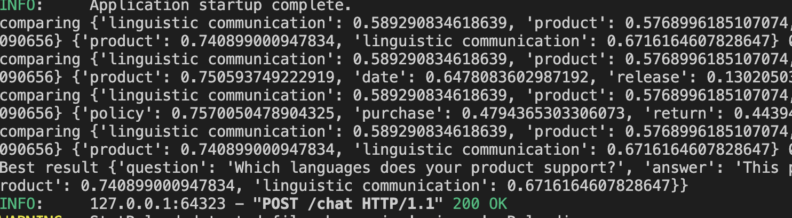
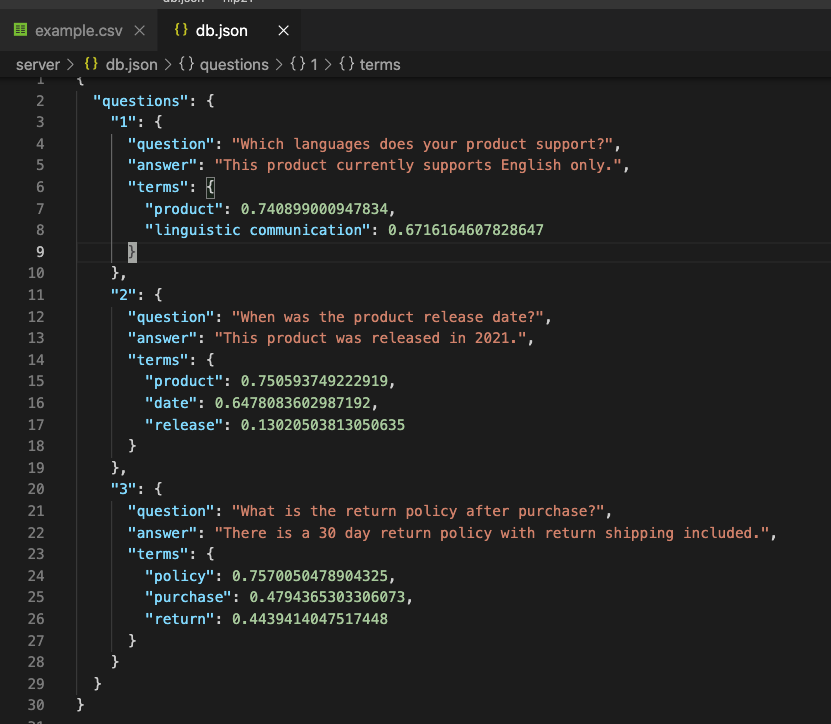

## ServiceBot

Create a customer service bot from any CSV or body of text.

Built for the Sentiment & Opinion Mining hackathon.

Powered by expert.ai for information extraction and bot dialogue.

### See slides

https://docs.google.com/presentation/d/1fLPORsXEtYSHxpIQdB-LL4HICs6gL5utpdlWhnvobbw/edit?usp=sharing

## Testing

Frontend `service-bot`

<pre>
yarn
yarn start
</pre>

Backend `server`

<pre>
pip install -r requirements.txt
uvicorn main:app --reload
</pre>

1. To get started, upload a csv on the front end that has your question database in the two column format: question,answer. See `data/example.csv` as an example.

2. Once a csv is uploaded, the data will be saved in a file `server/db.json`. To create a bot based on a new dataset, delete this file and refresh the website.

3. The bot uses expert.ai to extract themes and match customer inquiry to the dataset. If the bot is unable to find a remote match it will display a generic error message. The bot will work more effectively in more scenarios with a larger csv or connected dataset.

### Screenshots

    <h3>Match</h3>
    
    <h3>No Match</h3>
    
    <h3>Match logs</h3>
    
    <h3>Stored model</h3>
    

